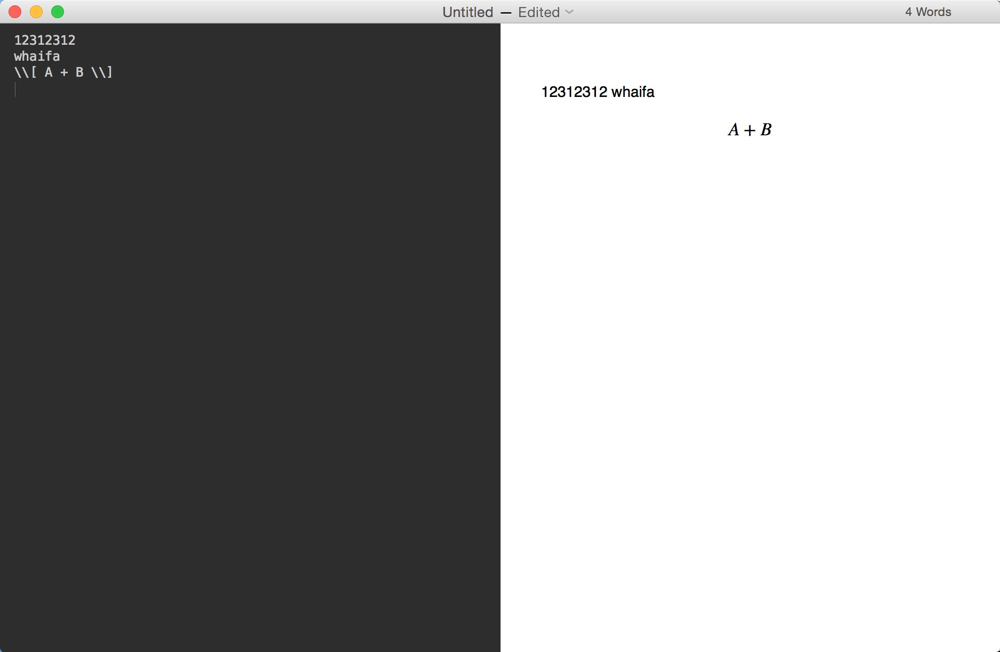
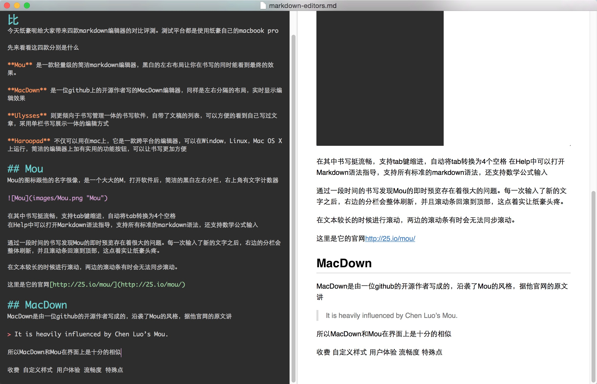
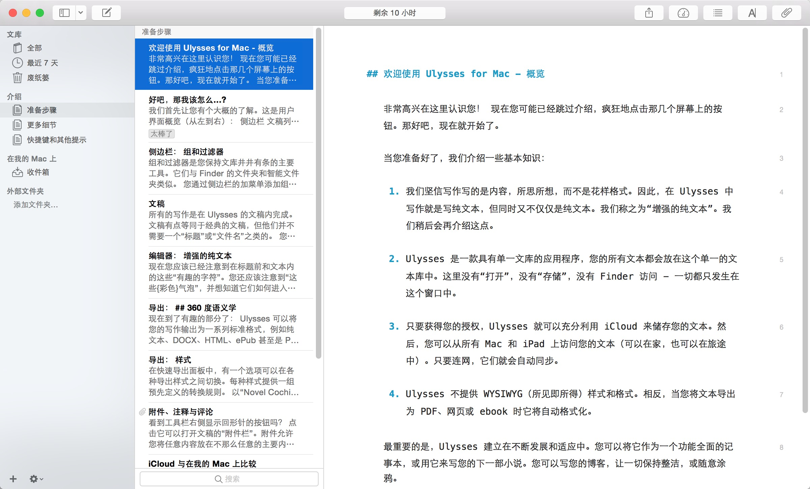
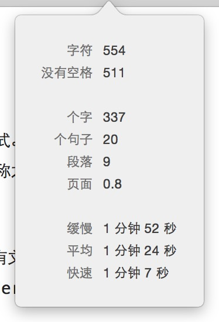
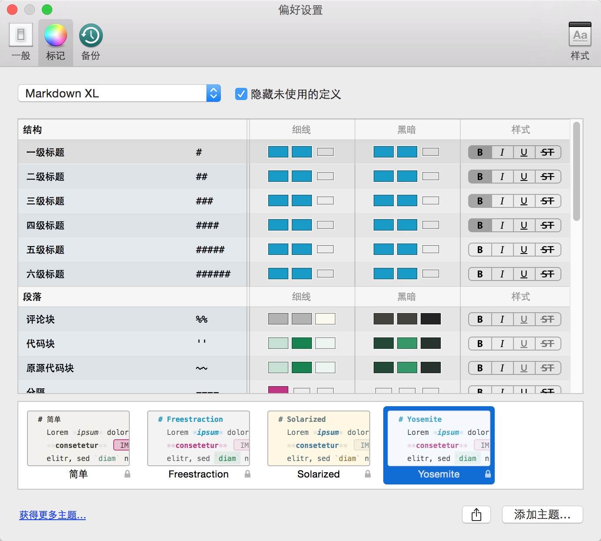
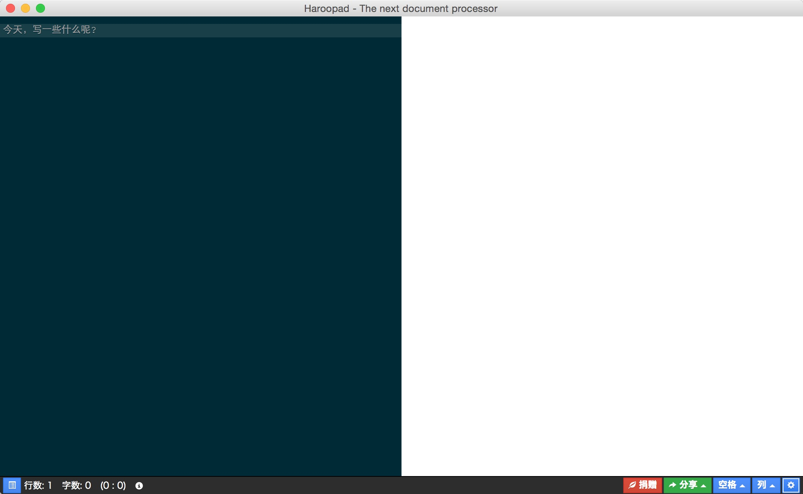
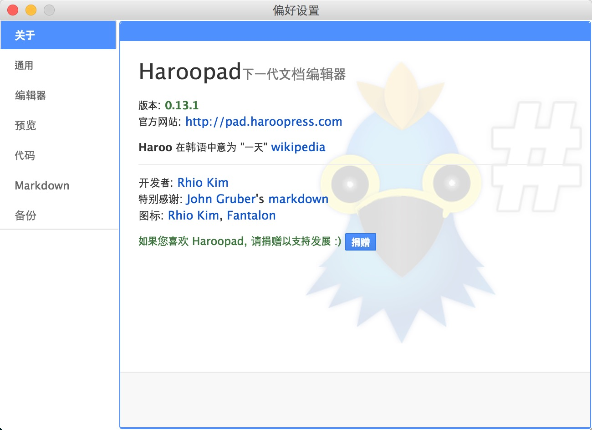

# 书写至上——Mac OS X 下的Markdown编辑器对比
今天纸豪呢给大家带来四款markdown编辑器的对比评测。测试平台都是使用纸豪自己的macbook pro

先来看看这四款分别是什么

**Mou** 是一款轻量级的简洁markdown编辑器，黑白的左右布局让你在书写的同时能看到最终的效果。

**MacDown** 是一位github上的开源作者写的MacDown编辑器，同样是左右分隔的布局，实时显示编辑效果

**Ulysses** 则更倾向于书写管理一体的书写软件，自带了文稿的列表，可以方便的看到自己写过文章，采用单栏书写展示一体的编辑方式

**Haroopad** 不仅可以用在mac上，它是一款跨平台的编辑器，可以在Window，Linux，Mac OS X上运行，简洁的编辑器上加有实用的功能按钮，可以让书写更加方便

## Mou
Mou的图标跟他的名字很像，是一个大大的M，打开软件后，简洁的黑白左右分栏，右上角有文字计数器

在其中书写挺流畅，支持tab键缩进，自动将tab转换为4个空格
在Help中可以打开Markdown语法指导，支持所有标准的markdown语法，还支持数学公式输入

通过一段时间的书写发现Mou的即时预览存在着很大的问题。每一次输入了新的文字之后，右边的分栏会整体刷新，并且滚动条回滚到顶部，这点着实让纸豪头疼。

在文本较长的时候进行滚动，两边的滚动条有时会无法同步滚动。

在设置界面中支持自定义显示样式，会CSS的童鞋也可以自己定义样式。

这里是它的官网 [http://25.io/mou/](http://25.io/mou/)

## MacDown
MacDown是由一位github的开源作者写成的，沿袭了Mou的风格，据他官网的原文讲

> It is heavily influenced by Chen Luo’s Mou.

所以MacDown和Mou在界面上是十分的相似，除了没有右上角的文字计数器，其他就想是一个模子里造出来的

MacDown编辑器则要比Mou在书写体验上要顺滑的多，在输入的过程中，右侧的即时显示区域不会整体刷新导致闪烁，而且滚动条也能保持在当前书写的位置。

支持所有标准的Markdown语法，支持数学公式输入，不过缺点就是数学公式的即时显示需要网络，这就导致公式一多，在输入的过程中会发生卡顿的现象，纸豪猜测是因为网络连接带来的延迟导致的。

因为和Mou很像，所以MacDown也有几个可选的内置样式和自定义样式。

MacDown官网传送门 [http://macdown.uranusjr.com/](http://macdown.uranusjr.com/)

## Ulysses
Ulysses的风格则跟上面两款编辑器不同，它更像是一款文章管理应用，通过列表和不同文件夹分类的方式管理你的所有文稿，书写和展示在同一栏中。

Ulysses可以将你的文稿和iCloud同步，完全不用担心文稿会丢失，还通过标签，注释，搜索等更好的帮助你管理和查找文稿。

点击右上角的仪表板，就可以显示非常详细的书写数据

右上角A的图标可以帮助用户更加方便的插入图片视频等多媒体，完全可以不用记一些复杂的语法了呢。

Ulysses的设置界面使用可视化的方式来展示样式，用户可以自己定义每一种具体的格式的样式，这比写CSS要方便许多。

用户也可以通过点击左下角的获取更多主题，在ulysses的网站上选择已经有的主题，也省去了自己一个个配置的麻烦。

不过这么强大的Ulysses自然是要收费的，而且也不便宜，虽然现在能在网上下载到Demo版，但是只能用10个小时还是让纸豪很不甘心的。

官网在此 [http://www.ulyssesapp.com/](http://www.ulyssesapp.com/)

## Haroopad
Haroopad则是跨平台的宝贝。支持Windows，Linux，Mac OS X三个平台就足以让人投入他的怀抱。同样简洁的界面，在底部的工具栏里有很多实用的功能按键。最左边的蓝色按钮点击就可以打开简洁的语法说明，这样的设计着实让人感觉舒心。

和MacDown一样的即时显示，不会导致滚动条回到顶部，内置的默认样式让文稿看起来十分优雅。

在设置中也可以通过自定义CSS文件来改变样式，而同时也可以设置代码块的显示风格，可以自己选择喜好的配色方案和显示效果。

Haroopad官网 [http://pad.haroopress.com/](http://pad.haroopress.com/)

## 横向对比
说了那么多单个应用的特点，下面纸豪君就要拿出必杀的表格。

横向对比一下这四款应用。

|    | 收费 | 自定义样式 | 书写体验 | 特殊点 | 官网 |
|:--:|:---:|:---------:|:------:|:------:|:--:|
| Mou | 免费 | CSS方式设置 | 良好，滚动同步不太好 | 体积小 | [http://25.io/mou/](http://25.io/mou/) |
| MacDown | 免费 | CSS方式设置 | 好，预览要比Mou顺畅 | 支持行内数学标记，不过需要联网 | [http://macdown.uranusjr.com/](http://macdown.uranusjr.com/) |
| Ulysses | 收费（283CNY） | 图形化自定义和丰富的网上主题 | 好，展示和书写在同一栏 | 支持更加丰富的多媒体展现方式，导出pdf，epub等格式，有iPad版本 | [http://www.ulyssesapp.com/](http://www.ulyssesapp.com/) |
| Haroopad | 免费 | CSS方式设置，可单独为代码设置风格 | 好，简洁的主界面上有丰富的功能按键 | 跨平台 | [http://pad.haroopress.com/](http://pad.haroopress.com/) |

看完了这张表格大家是不是都有心目中自己最喜欢的markdown应用了呢？

