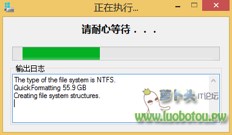

# Windows To Go - 带着走的Windows系统
windows to go已经不是什么新鲜玩意了，从windows 8.1 企业版开始就已经支持windows to go了，可是它是什么呢？windows to go可以将你的windows系统装进移动硬盘里，想象一下即插即用的windows系统还不占电脑本身的硬盘，尤其是像mac这种视硬盘资源如黄金的平台。

纸豪君这两天就尝试安装了windows to go，然后愉快的在自己的macbook pro上玩起了看门狗（哇嘎嘎

装windows to go的起因就是想要玩windows下的游戏，虚拟又带不起，纸豪又不想装双系统，所以呢就想到了windows to go，几番尝试也终于是成功了～

纸豪在给电脑拍照的时候都抑制不住内心的喜悦。

好了，按耐住激动的心情，我们回到正题，本文呢就简要介绍一下windows to go如何安装到又如何在mac上运行的过程（以及纸豪君亲身踩的那些坑

先说一下要准备的东西

* wtga工具 这个是用来安装windows to go的
* windows 8.1 enterprise iso镜像文件
* 一个移动硬盘
* 一个U盘（要是只有移动硬盘，可以借周围人的
* 一个windows系统的电脑（同样可以借～

开始纸豪君尝试过把windows to go安装在U盘里，可是几番折腾都以失败告终，也许是纸豪的32G小U还是太弱了，不过呢只好也在万能的淘宝上都了一下windows to go的U盘，还真有，有兴趣的童鞋可以尝试一下安装在这种U盘中。

废话少叙，进入正题

首先呢在windows里面打开wtga软件
像这个样子

这个时候呢你需要把移动硬盘插上，把之前下好的windows 8.1 enterprise iso镜像文件加载上，点选加载的镜像中的install.wim，在下面选择你自己的移动硬盘，然后是最重要的一步要点选右边高级模式的UEFT＋GPT模式，要不然mac无法识别哦（还有要确保时VHD模式）

然后就是漫长的等待了～ 他结束的时候会弹出写入成功的对话框（记住一定要看到这个对话框才能算写入成功！要是没有出这个框就写入完毕了，很有可能是出错了，纸豪建议再写一次）

下一步呢就要用到U盘和mac上Boot Camp软件把苹果电脑的硬件驱动都下载下来，又是一个漫长的过程，Boot Camp呢只药勾选下载最新的windows支持软件就好了～

把U盘插到mac上，用Boot Camp下载最新的驱动

然后呢，就可以把移动硬盘插到mac上重启，重启的过程中大家药要住option键，直到出现下面这个界面

选择右边那个黄色的硬盘，名字可能因人而异，纸豪这里是EFI Boot，然后就进入windows 8.1的欢迎界面了，在经过一系列的配置过程（就跟安装新的windows过程一样）windows君就安装好了。

不过呢，做到这一步的童鞋会发现：什么，不能上网。什么，没声音。什么，没右键！这些都不是问题，这个时候呢大家只需要插上之前的U盘，安装Boot Camp和相应的驱动～ 一切完美prefect

写到这里，纸豪的介绍也快到结尾了，虽然这个看似简短，但是纸豪中途格式化，重新安装，下载驱动来来回回经历了好几遍，才修成正果。

不过尝试的童鞋不要因为一边没有成功就放弃，因为windows在苹果电脑上看起来真的不错，对Retina屏支持的很好，很值得一试。

相关链接

* [wtga工具](http://bbs.luobotou.org/thread-761-1-1.html)
* [Windows 8.1 enterprise iso镜像文件官方版](https://msdn.microsoft.com/zh-cn/subscriptions/downloads/#searchTerm=&ProductFamilyId=545&Languages=cn&PageSize=10&PageIndex=0&FileId=0)